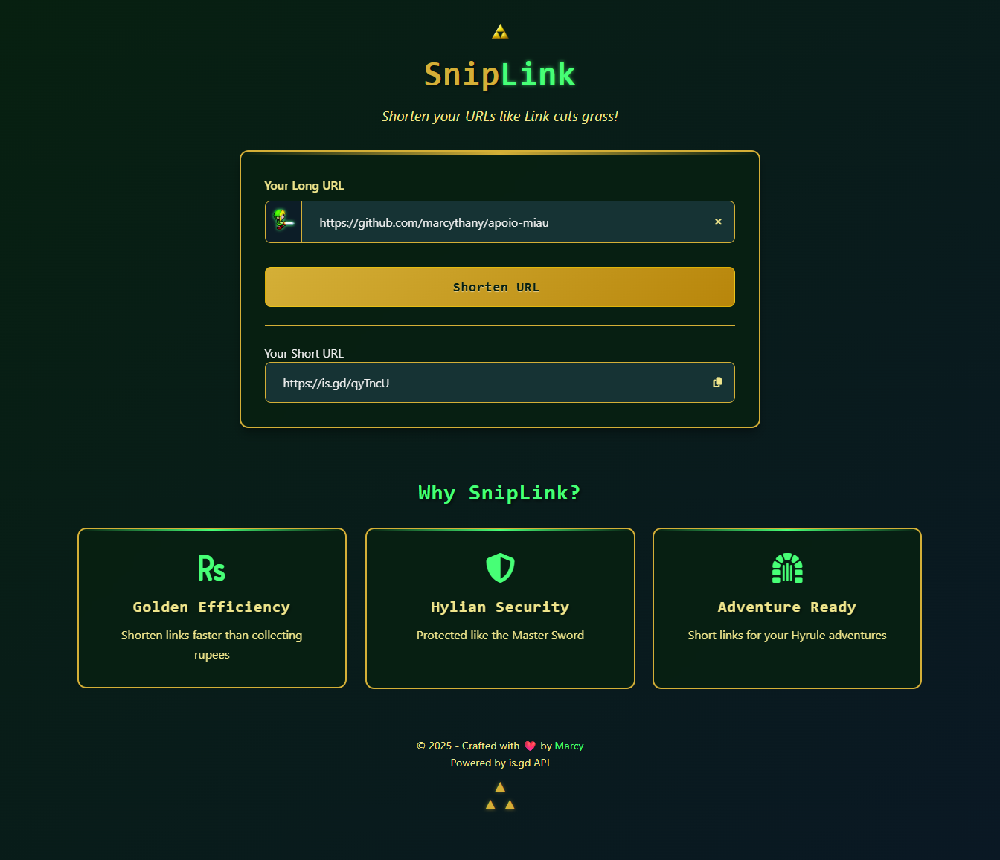

# SnipLink - Zelda-inspired URL Shortener



> "It's dangerous to go alone! Shorten your URLs!" - Ancient Hylian Proverb

SnipLink is a Legend of Zelda-themed URL shortener that transforms long URLs into shareable links. Featuring Link from the Zelda series, this tool "cuts" your URLs just like Link cuts grass in Hyrule. The project combines nostalgic gaming aesthetics with modern web technologies to create a delightful user experience.

## Features ✨

- **Zelda-themed UI**: Hylian gold and green color scheme with authentic styling
- **Link Character**: Our hero appears in the input field watching over your URLs
- **Triforce Decorations**: Authentic Zelda styling elements throughout
- **is.gd API**: Fast and reliable URL shortening service
- **Responsive Design**: Works flawlessly on all devices
- **Animated Feedback**: Smooth animations for copy confirmation and loading states
- **Modern Web Standards**: Built with pure HTML, CSS, and JavaScript (no frameworks)

## Tech Stack 🛠️

- **Frontend**: HTML5, CSS3 (Zelda-themed), JavaScript (ES6+)
- **API**: [is.gd](https://is.gd) URL shortening service
- **Icons**: Font Awesome for Zelda-themed icons
- **Animations**: Pure CSS animations for loading and UI feedback

## Live Demo 🌐

[Try SnipLink Live](https://snip-link.vercel.app/)

## Setup and Installation 🚀

1. **Clone the repository**:

   ```bash
   git clone https://github.com/marcythany/SnipLink.git
   cd SnipLink
   ```

2. Install dependencies (none required!):

bash

## This project has zero dependencies

3. Open in your browser:

Simply open index.html in any modern browser

Or use a local server:

bash
npx serve

4. Start shortening URLs:

Enter a long URL in the input field

Click the "Shorten URL" button

Copy your shortened link with the copy button

How It Works ⚙️

```Diagram
sequenceDiagram
participant User
participant Frontend
participant API
User->>Frontend: Enters long URL
Frontend->>API: Sends URL to is.gd API
API-->>Frontend: Returns shortened URL
Frontend->>User: Displays result with copy button
User->>Frontend: Copies shortened URL
Frontend->>User: Shows "Copied!" confirmation
```

Project Structure 📂

```text
SnipLink/
├── assets/
│ └── images/
│ ├── rinku_solo.png # Link character from Zelda
│ ├── triforce.png # Triforce icon
│ └── preview.png # Project screenshot
├── css/
│ └── style.css # Zelda-themed styles
├── js/
│ └── app.js # Application logic
├── index.html # Main HTML file
├── README.md # This documentation
└── LICENSE # MIT License
```

API Documentation 🔗
SnipLink uses the is.gd API for URL shortening:

javascript
// API Endpoint
const API_URL = '<https://is.gd/create.php?format=json&url=>';

// Example usage
async function shortenUrl(longUrl) {
const response = await fetch(`${API_URL}${encodeURIComponent(longUrl)}`);
const data = await response.json();
return data.shorturl; // Returns shortened URL
}
Customization 🎨
You can customize the Zelda theme by modifying these CSS variables:

css
:root {
--hyrule-green: #0a1824;
--hyrule-dark: #072010;
--hylian-gold: #d4af37;
--hylian-gold-light: #f0e68c;
--rupee-green: #47ff76;
--text-light: #f0f0f0;
}
Contributing 🤝
Contributions are welcome! Please follow these steps:

Fork the repository

Create a new branch (git checkout -b feature/your-feature)

Commit your changes (git commit -am 'Add some feature')

Push to the branch (git push origin feature/your-feature)

Open a pull request

License 📄
This project is licensed under the MIT License - see the LICENSE file for details.

May the way of the Hero lead to the Triforce! ▲ ▲ ▲
